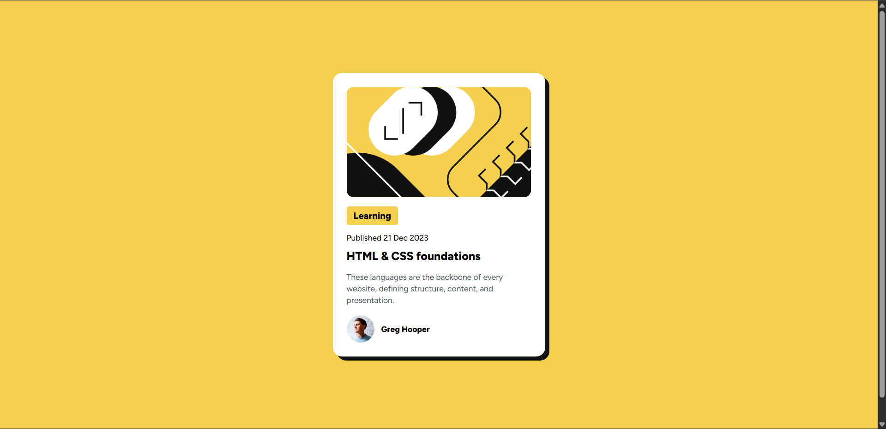

# Frontend Mentor - Blog preview card solution

This is a solution to the [Blog preview card challenge on Frontend Mentor](https://www.frontendmentor.io/challenges/blog-preview-card-ckPaj01IcS). Frontend Mentor challenges help you improve your coding skills by building realistic projects.

## Table of contents

* [Overview](#overview)

  * [The challenge](#the-challenge)
  * [Screenshot](#screenshot)
  * [Links](#links)
* [My process](#my-process)

  * [Built with](#built-with)
  * [About the Shadow](#about-the-shadow)
  * [Reusable Components](#reusable-components)
  * [Acknowledging AI Help](#acknowledging-ai-help)
  * [Useful resources](#useful-resources)
* [Author](#author)

## Overview

### The challenge

Users should be able to:

* See hover and focus states for all interactive elements on the page.

### Screenshot



### Links

* **Solution URL:** [solution](https://github.com/rop2024/blog-post-fem)
* **Live Site URL:** [live results](https://rop2024.github.io/blog-post-fem/)

## My process

### Built with

* Semantic HTML5 markup
* Flexbox
* CSS Grid
* Mobile-first workflow
* Tailwind CSS

### About the Shadow

In Tailwind, shadows are applied with classes like:

* `shadow-sm` → small subtle shadow
* `shadow` → default shadow
* `shadow-md` → medium depth
* `shadow-lg` → large
* `shadow-xl`, `shadow-2xl` → deeper shadows
* `shadow-inner` → inset shadow
* `shadow-none` → remove shadow

Example:

```html
<div class="p-4 rounded-lg shadow-md bg-yellow-200">
  Work Learning
</div>
```

This gives a clean, card-like effect.

### Reusable Components

When working with Tailwind, think in terms of **patterns** you’ll need repeatedly. In this project, potential reusable components include:

* **Card component** (shadow, padding, rounded corners, background)
* **Button styles** (primary, secondary, ghost)
* **Tag/Badge component** (small label with rounded background)
* **Layout wrappers** (container with max-width, flex/grid structure, spacing)
* **Navbar/Footer blocks** (common across pages)

### Acknowledging AI Help

> This project was developed with assistance from AI tools (ChatGPT) for styling guidance and component structuring.

### Useful resources

* [Tailwind CSS Documentation](https://tailwindcss.com/docs/installation/using-vite)

## Author

* Frontend Mentor - [@rop2024](https://www.frontendmentor.io/profile/rop2024)

---
